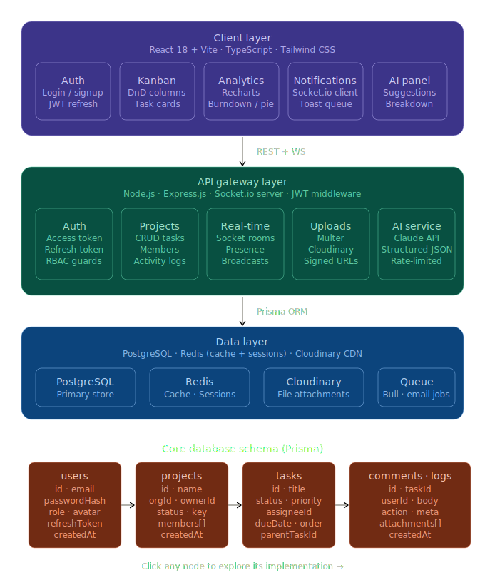

# TaskFlow

An AI-augmented project management tool built with Next.js 16 (App Router), React 19, Prisma 7, and Postgres. Multi-org workspaces, kanban with drag-and-drop, real-time updates over SSE, comments with @mentions, file attachments, sprints + analytics, and Claude-powered insights.



> The diagram above is the **conceptual architecture** from the original spec — three tiers (client / API / data). The actual implementation collapses the client + API gateway into a single **Next.js App Router** application so server components, route handlers, and server actions all live in one process. See [docs/architecture.md](docs/architecture.md) for how the conceptual layers map to the Next.js implementation.

---

## What's in the box

| Domain | Highlights |
|---|---|
| **Auth** | Email + password, bcrypt-hashed, jose-signed JWT in HTTP-only cookie, 7-day TTL |
| **Multi-org** | Personal workspace on signup, switch via header dropdown, per-org brand color |
| **Projects** | CRUD, key prefix (`PROJ-42`), per-project accent color that overrides org color in scope |
| **Kanban** | 6-status board, drag-and-drop via `@dnd-kit`, optimistic UI, LexoRank-style float ordering |
| **Tasks** | Priorities, story points, due dates, assignee, sprint, 4-tab detail view (Edit / Activity / Attachments / Management) |
| **Comments** | Plain text with `@name` mention parsing, 15-min edit window, watcher + mention notifications |
| **Activity log** | Auto-recorded on every mutation, interleaved with comments in the task feed |
| **Notifications** | Bell badge with unread count, in-app list, realtime push to user channel |
| **Attachments** | Multipart upload via Server Actions, 10 MB cap, mime allowlist, image thumbnails + file tiles |
| **Sprints** | Create / start / complete / delete, story-point velocity per sprint |
| **Analytics** | Status donut, velocity bars, cumulative completion line (recharts), AI-generated insights |
| **Real-time** | In-memory pub/sub broker + SSE route, three channel types (`project:` / `task:` / `user:`) |
| **AI** | Claude Opus 4.7 via official SDK with structured outputs (Zod), description generation, project insights |
| **RBAC** | Org roles (OWNER / ADMIN / MEMBER / VIEWER) enforced server-side in DAL |

---

## Tech stack

- **Framework**: [Next.js 16](https://nextjs.org) (App Router, Turbopack, React Server Components)
- **UI**: React 19 + Tailwind CSS v4 (CSS-variable token system, dynamic per-org brand colors)
- **DB**: Postgres 16 + Prisma 7 with `@prisma/adapter-pg` driver adapter
- **Auth**: `jose` for JWT signing, `bcryptjs` for password hashing, HTTP-only cookies
- **Validation**: Zod 4
- **Drag & drop**: `@dnd-kit/core` + `@dnd-kit/sortable`
- **Charts**: `recharts`
- **AI**: `@anthropic-ai/sdk` with `messages.parse()` + `zodOutputFormat()` for typed outputs
- **Real-time**: native `ReadableStream` / `EventSource` over a Route Handler

---

## Quick start

### Prerequisites

- Node.js 20+ (the dev shell here used 25 — newer is fine)
- Postgres 14+ running locally (or Postgres.app on macOS)
- An `ANTHROPIC_API_KEY` if you want to try the AI features (everything else works without it)

### Setup

```bash
# 1. Install dependencies
npm install

# 2. Create the database
createdb taskflow_dev

# 3. Copy env template and fill in
cp .env.example .env.local
# - DATABASE_URL: point to your local Postgres
# - SESSION_SECRET: openssl rand -base64 32
# - ANTHROPIC_API_KEY: optional, only for AI features

# 4. Run migrations + generate the Prisma client
npx prisma migrate deploy
npx prisma generate

# 5. Start the dev server
npm run dev
```

Open http://localhost:3000 — you'll be redirected to `/login`. Sign up to create your first user; a personal workspace is created automatically.

### Environment variables

| Var | Required | Notes |
|---|---|---|
| `DATABASE_URL` | yes | Postgres connection string. Used by both Prisma client and migrations (via `prisma.config.ts`) |
| `SESSION_SECRET` | yes | 32-byte random string. Signs the session JWT |
| `ANTHROPIC_API_KEY` | no | Enables AI features. Without it, those buttons return a graceful "key not set" message |

---

## Project structure

```
.
├── app/                              # Next.js App Router
│   ├── (auth)/                       # /login, /signup
│   ├── (app)/                        # Authed app shell + pages
│   │   ├── _components/              # Shared client components (org switcher, bell, dialogs)
│   │   ├── dashboard/
│   │   ├── notifications/
│   │   ├── projects/
│   │   │   ├── new/
│   │   │   └── [id]/                 # Project layout injects per-project brand color
│   │   │       ├── _components/      # kanban-board, task-card, filter-bar, ...
│   │   │       ├── sprints/
│   │   │       ├── analytics/
│   │   │       ├── settings/
│   │   │       └── tasks/[taskId]/   # 4-tab layout
│   │   │           ├── activity/
│   │   │           ├── attachments/
│   │   │           └── management/
│   │   └── settings/
│   │       ├── org/                  # General + Members route group
│   │       └── user/
│   ├── api/realtime/                 # SSE route handler
│   ├── lib/actions/                  # Server actions per domain
│   │   ├── auth.ts
│   │   ├── orgs.ts
│   │   ├── projects.ts
│   │   ├── tasks.ts
│   │   ├── comments.ts
│   │   ├── attachments.ts
│   │   ├── sprints.ts
│   │   ├── notifications.ts
│   │   ├── ai.ts
│   │   └── user.ts
│   ├── globals.css                   # Token system (white theme + dynamic brand color)
│   └── layout.tsx                    # Root HTML + suppressHydrationWarning
├── lib/                              # Server-only libs (validation, DAL, helpers)
│   ├── db.ts                         # Prisma singleton with PrismaPg adapter
│   ├── session.ts                    # jose JWT in HTTP-only cookie
│   ├── dal.ts                        # verifySession, getCurrentUser, RBAC helpers
│   ├── validation.ts                 # All Zod schemas
│   ├── activity.ts                   # logActivity helper
│   ├── notifications.ts              # parseMentions, createNotifications
│   ├── realtime.ts                   # In-memory pub/sub broker
│   ├── storage.ts                    # File save/delete (local driver, swappable to Cloudinary)
│   ├── color.ts                      # WCAG contrast helper, brand color presets
│   ├── order.ts                      # LexoRank getOrderBetween
│   └── ai.ts                         # Claude SDK wrapper with structured outputs
├── prisma/
│   ├── schema.prisma                 # Single source of truth for the data model
│   └── migrations/
├── proxy.ts                          # Next.js 16 — replaces middleware.ts
├── public/                           # Static assets + uploaded files
│   ├── images/                       # Diagrams, README assets
│   └── uploads/                      # User attachments (gitignored)
└── docs/                             # See below
```

---

## Documentation

Backend deep-dives live in [docs/](docs/):

- **[Architecture](docs/architecture.md)** — request flow, layer responsibilities, how the spec's three tiers collapse into Next.js
- **[Database](docs/database.md)** — Prisma schema walkthrough, FK cascades, indexes, the LexoRank ordering trick
- **[Authentication](docs/auth.md)** — session lifecycle, the DAL pattern, RBAC enforcement, optimistic vs. secure checks
- **[Server actions](docs/server-actions.md)** — action shape, validation, error handling, redirect/revalidate patterns
- **[Real-time](docs/realtime.md)** — SSE route, in-memory broker, channels, publish/subscribe, production scaling
- **[Storage](docs/storage.md)** — attachment uploads, the local driver, swap to Cloudinary in one file
- **[AI](docs/ai.md)** — Claude Opus 4.7 integration, structured outputs with Zod, prompt design

---

## Default test users

After running the seed (or signing up your own), two ready-to-go accounts are available:

| User | Email | Password |
|---|---|---|
| Alice | `alice@taskflow.local` | `Alice1234` |
| Bob | `bob@taskflow.local` | `Bob12345` |

Sign in as Alice, switch to **Demo Team** via the header dropdown to see the seeded multi-user collaboration scenario (kanban with cards, comment threads with @mentions, sprint, analytics).

---

## Scripts

```bash
npm run dev         # Start the dev server with Turbopack
npm run build       # Production build (typechecks + bundles)
npm run start       # Start the production server (after build)
npm run lint        # ESLint
npx prisma studio   # Browse the database in a UI
```

---

## License

MIT — see [LICENSE](LICENSE).
